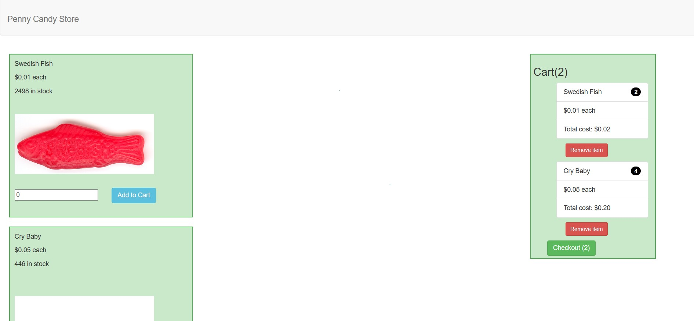

# Penny Candy Store

Example of an online store using React.js. Users are able to add items to their cart, and checkout those items. The appropriate data is updated to mark which items where checked out. 

